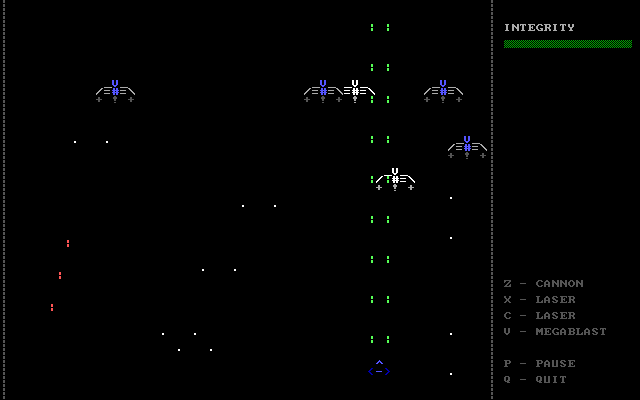
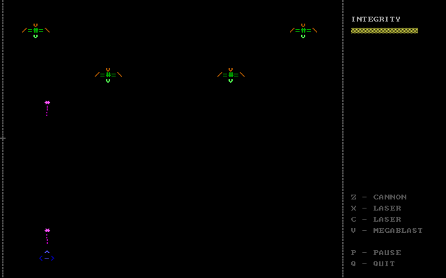
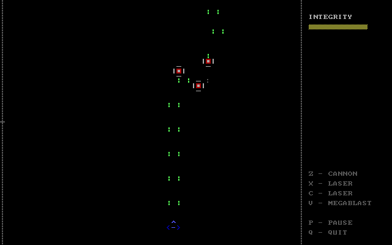
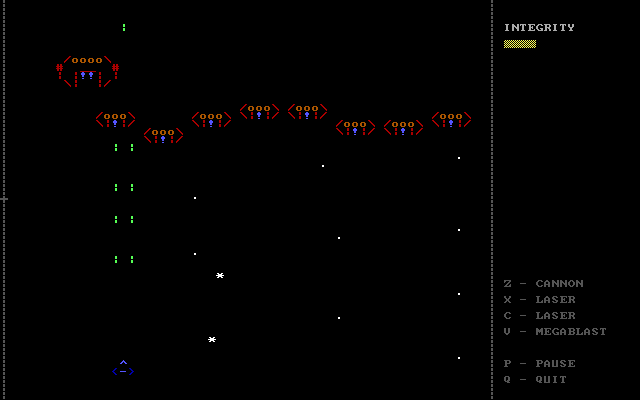

# SpaceAssault
DOS space shooter in ASCII.

## Screenshots







## Development setup

1. Unpack copy of Borland's TurboC somewhere.
2. Pull this repository into a working copy.
3. Make a copy of `MAKEFILE.LOC.template` named `MAKEFILE.LOC` and update it's contents to match Your environment.
4. Run DosBox so it sees `turboc` and Your working copy. For example (more lines for better readability):
  ```sh
  start "Space Assault dev"                           # give the window nice title
  "C:\Program Files (x86)\DOSBox-0.74\DOSBox.exe"     # path to Your DosBox installation
  -c "mount C C:\Data\projects\dos"                   # path mounted to DosBox's C:, must contain both turbox and working copy
  -c "C:" -c "cd spaceass"                            # after starting DosBox, switch to C:/spaceass (in mounted filesystem)
  -c "set PATH=C:\turboc\bin"                         # make DOS see the "make" utility
  -noconsole                                          # do not open underlying console window for DosBox
  ```
5. Simply type `make` to recompile and build the project.
